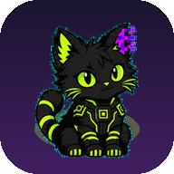

<p align="center"></p>

# TamagotchIA

Una criatura de bolsillo que vive en tu teléfono. Tiene hambre, sueño, ánimo y memoria; crece si la cuidas y se enferma si la olvidas. Un modelo de lenguaje puede ser su voz, pero **el juego lo decide un motor determinista**: el modelo solo le pone palabras.

- **Funciona sin internet y sin clave.** La criatura tiene su propia voz local.
- **Se instala como app** (PWA) desde el navegador del teléfono.
- **Cualquier modelo compatible con OpenAI** puede ser su persona: OpenRouter, NVIDIA, OpenAI u Ollama. La clave se queda en el teléfono.
- **Dos especies**, con el arte de [Companion](https://github.com/DannyBaanks/Companion): Malbolgato (neón) y Shinji (cálido).

```text
acción → motor determinista → estado + evento → modelo (resumen acotado) → frase corta
```

## Probarlo

```bash
npm install
npm run dev      # http://localhost:5173
npm test         # 54 tests: motor, voz, guardado y avisos
npm run build    # la app completa en dist/
```

Los comandos con su salida real y las trampas están en la **[guía en español](GUIA.md)**.

## Qué hay adentro

| Carpeta | Qué hace |
|---|---|
| `src/engine/` | El motor: simulación en pasos de 5 minutos con tope de 72 h, comandos, enfermedad, evolución y política de recuerdos. Funciones puras con el reloj inyectado |
| `src/persona/` | El contrato de la voz: qué ve el modelo, qué puede responder (3 a 20 palabras y listas cerradas) y la voz local de respaldo |
| `src/store/` | Guardado con checksum y respaldo automático; la clave va aparte y nunca se exporta |
| `src/ui/`, `src/app.ts` | La pantalla: hábitat, burbujas, minijuego, diario, ajustes y debug |
| `public/sw.js` | Modo offline: guarda la app y todas las poses |

El diseño completo está en [SPEC.md](SPEC.md) (§16 explica por qué pasó de Python a PWA) y el plan en [ROADMAP.md](ROADMAP.md).

## Estado

`0.1` jugable. Verificado en Chrome headless a 390×844: onboarding, eclosión, los dos hábitats, comer, platicar, minijuego, diario, ajustes, debug, recarga sin red y la voz de un modelo contra un endpoint local de prueba.

**NO PROBADO:** un proveedor de modelos real, un teléfono físico y la instalación desde HTTPS. Detalles en la [guía](GUIA.md).

## Licencia

MIT. El arte viene de Companion (MIT) y la fuente es Fredoka (OFL-1.1); ver [NOTICE.md](NOTICE.md).
