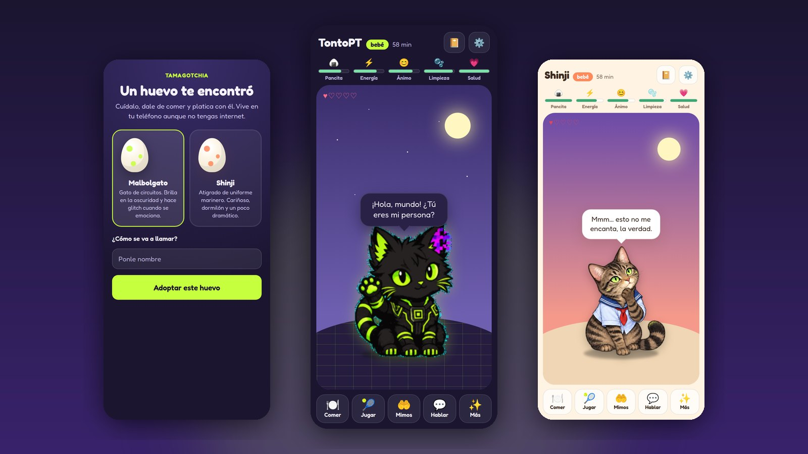
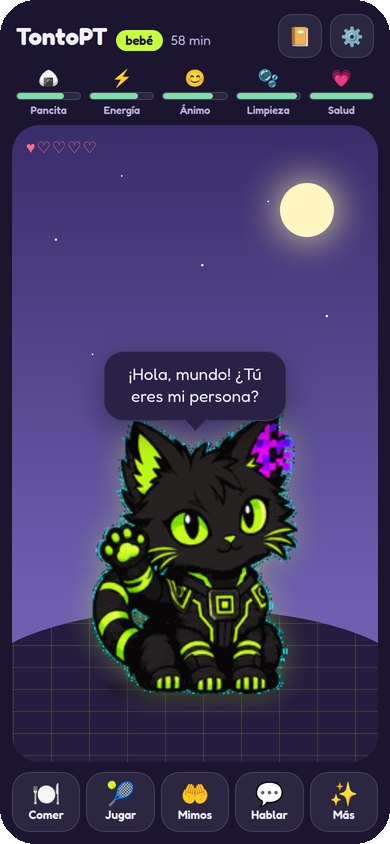
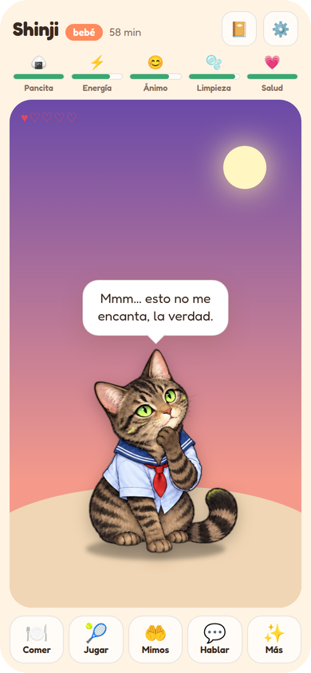
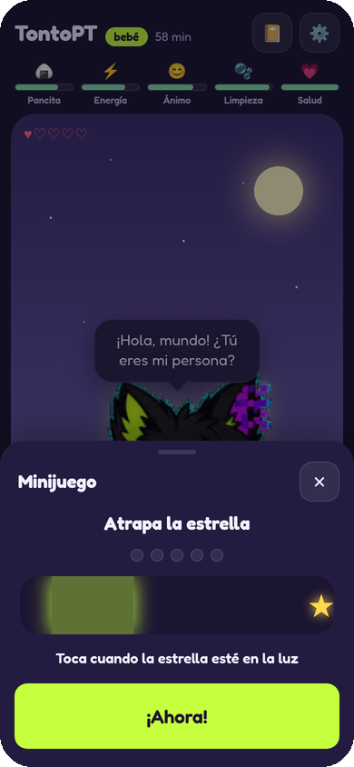
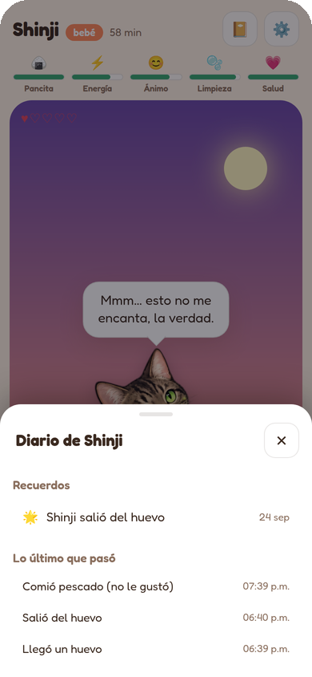

<p align="center">
  
</p>

<h1 align="center">TamagotchIA</h1>

<p align="center">
  <strong>Una criatura de bolsillo que vive en tu teléfono.</strong><br>
  Tiene hambre, sueño y memoria. Crece si la cuidas. Y si quieres, una IA le pone voz.
</p>

<p align="center">
  <a href="https://dannybaanks.github.io/TamagotchIA/"><strong>▶&nbsp; Jugar ahora</strong></a>
  &nbsp;·&nbsp; gratis &nbsp;·&nbsp; sin cuenta &nbsp;·&nbsp; funciona sin internet
</p>

---

## ¿Qué es?

¿Te acuerdas de los Tamagotchi, esos huevitos de llavero que había que alimentar para que no se pusieran tristes? TamagotchIA es eso mismo, pero en tu teléfono y con una personalidad de verdad.

Adoptas un huevo, le pones nombre y a los 90 segundos nace tu criatura. A partir de ahí depende de ti: **el tiempo sigue corriendo aunque cierres la app**. Si la alimentas, juegas con ella y la bañas, crece. Si te olvidas de ella, le da hambre, se ensucia y hasta se puede enfermar. No se muere, pero te extraña.

## Así se juega

| | |
|---|---|
| 🍽️ **Comer** | Manzana, arroz, pescado o dulce. Cada criatura tiene una comida que no soporta, y si le das mucho la misma, la vuelve su favorita. |
| 🎾 **Jugar** | Juega un rato o reta a tus reflejos con **Atrapa la estrella**. |
| 🤲 **Mimos** | Tócala. Se pone contenta, y si le haces mimos seguido, se encariña contigo. |
| 💬 **Hablar** | Dile algo y te contesta. |
| 🧽 **Bañar** · 🌙 **Dormir** · 🧭 **Explorar** | Cuando sale a explorar, trae tesoritos: una pluma azul, una canica verde, un caracol dormido… |
| 📔 **Diario** | Guarda sus recuerdos: el día que nació, su comida favorita, la vez que se enfermó y la cuidaste. |

Con los cuidados pasa de **bebé** a **peque** y luego a **grande**. Si la descuidas, no crece.

## Conoce a los huevos

<table>
  <tr>
    <td align="center" width="50%">
      <br>
      <strong>Malbolgato</strong><br>
      Gato de circuitos. Brilla en la oscuridad y hace glitch cuando se emociona.
    </td>
    <td align="center" width="50%">
      <br>
      <strong>Shinji</strong><br>
      Atigrado de uniforme marinero. Cariñoso, dormilón y un poco dramático.
    </td>
  </tr>
</table>

Cada uno tiene su propio cuarto, y el cielo cambia con la hora real: amanecer, día, atardecer y noche con estrellas.

<p align="center">
  
  &nbsp;&nbsp;
  
</p>

## Dale una voz con IA (opcional)

Sin configurar nada, tu criatura ya habla con frases propias. Pero si quieres que **improvise**, puedes conectarle una inteligencia artificial y se vuelve su personalidad: le cuentas algo y te contesta como la criatura, no como un asistente.

### Voz gratis en 3 minutos

La forma más fácil y **sin pagar nada** es OpenRouter, que tiene modelos gratis, incluidos los Nemotron de NVIDIA:

1. Entra a **[openrouter.ai](https://openrouter.ai)** y crea una cuenta (puedes entrar con Google o GitHub).
2. En el menú de tu cuenta busca **Keys** y crea una clave nueva. Empieza con `sk-or-`. Cópiala.
3. En TamagotchIA abre **Ajustes → La voz**:
   - marca **Usar un modelo como su voz**;
   - en **Proveedor** elige **OpenRouter (tiene modelos gratis)**: el modelo gratis se llena solo;
   - pega tu clave en **API key**.
4. Pulsa **Probar la voz**. Si ves **✓ Responde el modelo**, ya está.

Los modelos gratis son los que terminan en **`:free`** y tienen un límite de uso diario. Si uno deja de funcionar, busca otro en [openrouter.ai/models](https://openrouter.ai/models) y escribe su nombre en **Modelo**.

> **¿Y la clave gratis de NVIDIA (`nvapi-…`)?** Por ahora no funciona en la app web: el servidor de NVIDIA no deja que una página le hable directo (lo medimos: el navegador bloquea la respuesta). Los mismos modelos de NVIDIA están gratis en OpenRouter. Cuando exista la versión de app nativa, la clave `nvapi-` va a funcionar directo.

Si ya pagas otro servicio compatible (OpenAI, por ejemplo) o tienes un modelo en tu computadora con Ollama, también sirve: elígelo en **Proveedor**.

Dos cosas que nunca cambian:

- **La IA no puede hacer trampa.** Solo le pone palabras. El hambre, la salud y el crecimiento los decide el juego, y si la IA dice algo raro, se ignora.
- **Tu clave se queda en tu teléfono.** Solo viaja al servicio de IA que elegiste; no se guarda en la partida ni sale en los respaldos.

## Te avisa cuando te necesita

Activa los avisos en **Ajustes → Avisos** y te dice cuándo tiene hambre, se enfermó, se quedó sin energía o despertó. Viene con **horas de silencio** (de 10 de la noche a 8 de la mañana), para que no te despierte a las 3 a.m.; lo que pase de noche te lo cuenta en la mañana. También puedes ver a qué hora te va a necesitar si no haces nada.

> Por ahora los avisos llegan mientras la app sigue abierta en segundo plano. Con la app cerrada del todo, el teléfono no la deja despertar; eso llegará con la versión de app nativa.

## Instálala en tu celular

Entra a **[dannybaanks.github.io/TamagotchIA](https://dannybaanks.github.io/TamagotchIA/)** desde tu teléfono y:

- **Android (Chrome):** menú ⋮ → **Instalar app** (o «Agregar a la pantalla principal»).
- **iPhone (Safari):** botón Compartir → **Agregar a inicio**.

Queda con su propio ícono, se abre a pantalla completa y funciona aunque no tengas internet.

## Preguntas frecuentes

**¿Cuesta algo?**
No. Es gratis y no tiene anuncios ni compras. Si conectas una IA, lo que cobre ese servicio es entre tú y él.

**¿Necesito internet?**
Solo la primera vez que la abres. Después funciona sin conexión. La voz con IA sí necesita internet; sin él, habla con su voz propia.

**¿Mis datos se van a algún lado?**
No. No hay cuentas ni servidores: tu criatura vive solo en tu teléfono.

**¿Y si cambio de teléfono?**
**Ajustes → Exportar respaldo** te da un archivo. En el teléfono nuevo, **Importar** y listo: llega con todos sus recuerdos.

**¿Se puede morir?**
No. Si la descuidas se enferma y se pone triste, pero se recupera cuando vuelves a cuidarla.

**¿Si la dejo una semana sola?**
Al volver te va a extrañar mucho, pero la app no cuenta más de 3 días de ausencia, así que no te vas a encontrar un desastre.

## Estado

Versión **0.1**, recién salida del huevo 🐣. Está probada en Chrome con tamaño de celular y en Firefox de computadora. **Todavía no se ha probado** en un teléfono físico ni con un servicio de IA real; si encuentras algo raro, [cuéntanos](https://github.com/DannyBaanks/TamagotchIA/issues).

<details>
<summary><strong>Para desarrolladores</strong></summary>

```bash
npm install
npm run dev      # http://localhost:5173
npm test         # 55 tests: motor, voz, guardado y avisos
npm run build    # la app completa en dist/
```

- **Motor determinista** (`src/engine/`): funciones puras con el reloj inyectado. La simulación avanza en pasos de 5 minutos con tope de 72 horas, y el pronóstico de necesidades alimenta los avisos.
- **Contrato de la voz** (`src/persona/`): el modelo recibe un resumen acotado y debe responder un JSON (de 3 a 20 palabras, emoción, intención y animación de listas cerradas). Si no, habla la voz local.
- **Guardado** (`src/store/`): con checksum y respaldo automático; la clave va aparte.
- **PWA** (`public/sw.js`): funciona offline con todas las poses precargadas.

Todos los comandos, con su salida real y las trampas conocidas, están en la [guía](GUIA.md). El diseño está en [SPEC.md](SPEC.md) y el plan en [ROADMAP.md](ROADMAP.md).
</details>

## Créditos

Los personajes vienen de [Companion](https://github.com/DannyBaanks/Companion), la mascota de escritorio del mismo autor. La tipografía es Fredoka. Detalles de licencias en [NOTICE.md](NOTICE.md).

Hecho con cariño por [DannyBaanks](https://github.com/DannyBaanks). Licencia MIT.
